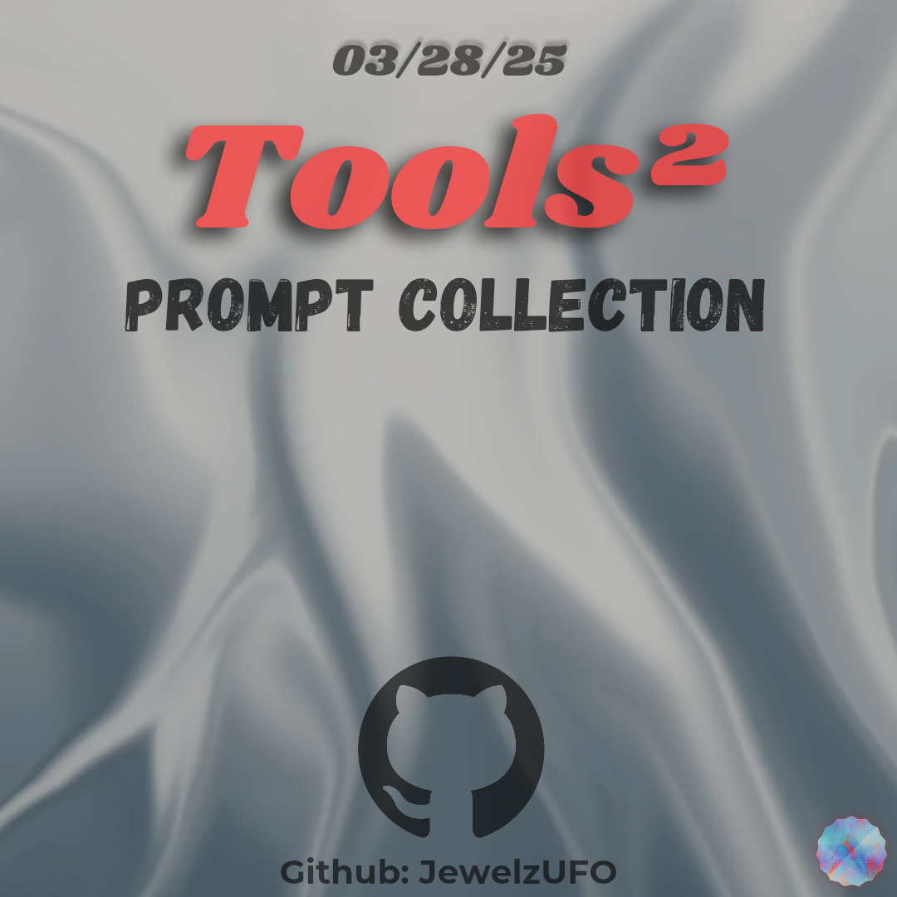

# Tools-two

## About
Tools 2 is a repository that contains approximately 100 "Tool use" prompts. 
The prompts in this repo work with large language models that have access to the internet, code interpreter, and URL Scaper tools (Mistral, Cohere, ChatGPT, etc.). 

## 📖Prompts
🚨[Prompts.md](https://github.com/Jewelzufo/Tools-two/blob/643d3135f2052e8e3b963d5c8095b91f547b190b/Prompts.md)

